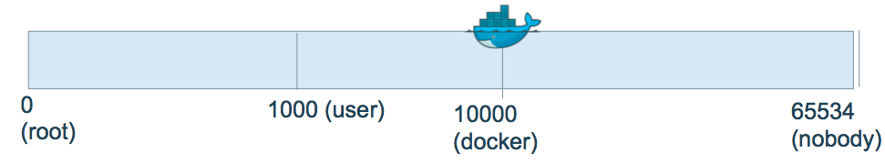
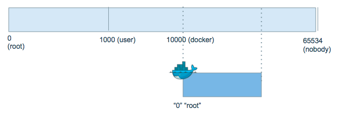

## Agenda

- Introduction
- Overview of Docker Security
- Isolation: Kernel Namespaces and Control Groups
- #### User Management
- Secure Image
- Networks
- Image Distribution
- Capabilities
- Seccomp
- Linux Security Modules

---

#User Management

---

##Default runs as root
```
$ docker run -v /bin:/host/bin -it --rm alpine sh
$ whoami
root
$ id
uid=0(root) gid=0(root)
$ # WREAK HAVOC TIME!  Please don’t do this
$ rm /host/bin/sh # Again, please don’t do this
```

---

##root in container == root outside container

We do not want this to be the case!
How can we change this?

---

##Step in the right direction: run as a user
- Use the --user flag with UID:GID argument

```
$ docker run -v /bin:/host/bin --user 10000:10000 -it --rm alpine sh
$ whoami
whoami: unknown uid 10000
$ id
uid=10000 gid=10000
$ rm /host/bin/sh
rm: can’t remove ‘sh’: Permission denied
```

---

##But I still want *root* inside container


Perhaps we need to run a command that needs to look like it’s root in the container, but we don’t want to give it
true
 root access to the underlying host

---

##Enable user namespaces
```
$ docker daemon --userns-remap [uid[:gid]]
```


---

##Enable user namespaces - common pitfalls
```
$ docker daemon --userns-remap [uid[:gid]]
```
- Will need to re-pull images and re-create volumes due to container resource and image layer permissions
  - Leave this feature on in production; switching back and forth should only be done in development
  

---

##Hands-On Exercise && break
```
github.com/riyazdf/dockercon-workshop
```
 - **userns** directory


---
