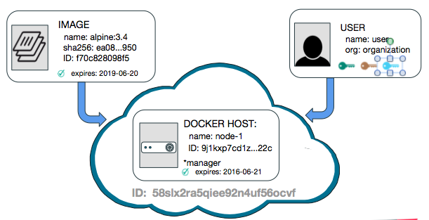
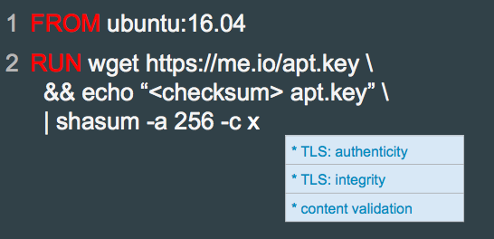
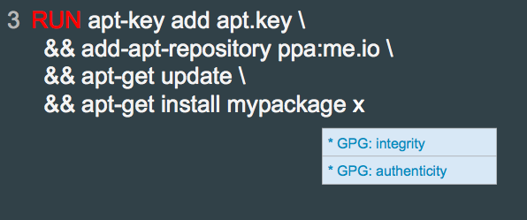
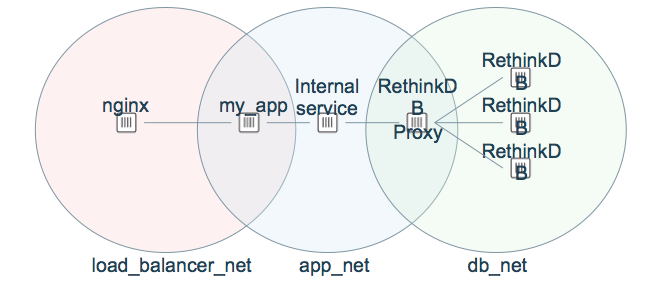
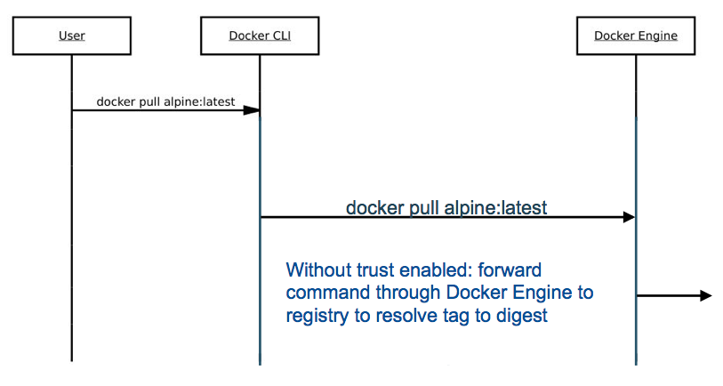
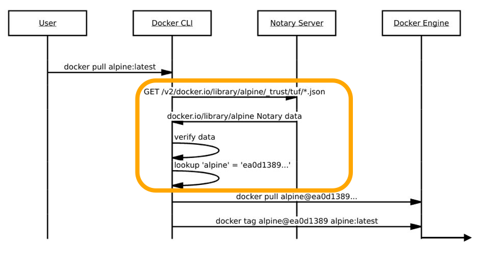
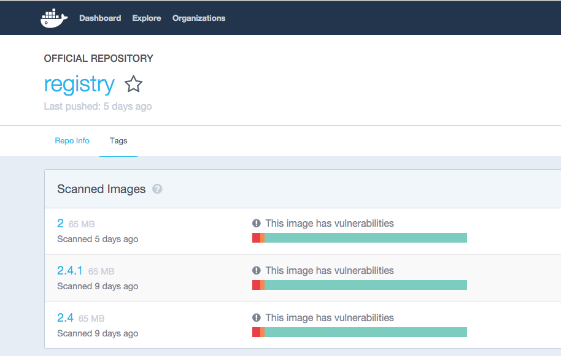
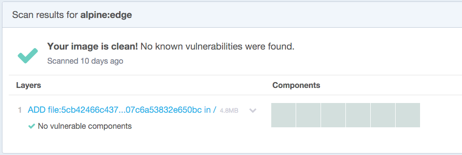

# Secure Image

---

## What is a layered filesystem?

WHAT IS IN AN IMAGE: = THE LAYERED FILESYSTEM

- Union filesystem
  - Combine multiple directories to look like a single filesystem
  - Tombstoning/whiteout files to delete files from lower layers

- Copy-on-write

Note:

Learn Docker layer filesystem
https://docs.docker.com/engine/userguide/storagedriver/imagesandcontainers/

Blog has video on Docker Storage
https://blog.docker.com/2015/10/docker-basics-webinar-qa/

---

## Supported Implementations

- Image layering and sharing with AUFS(unification filesystem)
- Rocked Image Layers (R/O)


Note: Each Docker image references a list of read-only layers.

Image layering and sharing with AUFS
AUFS is a unification filesystem. This means that it takes multiple directories on a single Linux host, stacks them on top of each other, and provides a single unified view. To achieve this, AUFS uses a union mount.

AUFS stacks multiple directories and exposes them as a unified view through a single mount point. All of the directories in the stack, as well as the union mount point, must all exist on the same Linux host. AUFS refers to each directory that it stacks as a branch.

Within Docker, AUFS union mounts enable image layering. The AUFS storage driver implements Docker image layers using this union mount system. AUFS branches correspond to Docker image layers. The diagram below shows a Docker container based on the ubuntu:latest image.

---

## Copy-on-write

- The major difference between a container and an image is the top writable layer.
- Each containers get its own writable layers
- Reduces the amount of space consumed by containers
- Reduces the time required to start a container


Note:
All writes to the container that add new or modify existing data are stored in this writable layer. When the container is deleted the writable layer is also deleted. The underlying image remains unchanged.

Because each container has its own thin writable container layer, and all changes are stored in this container layer, this means that multiple containers can share access to the same underlying image and yet have their own data state. The diagram below shows multiple containers sharing the same Ubuntu 15.04 image.

- Sharing promotes smaller images
- Copying makes containers efficient
  - All writes made to a container are stored in the thin writable container layer. The other layers are read-only (RO) image layers and can’t be changed. This means that multiple containers can safely share a single underlying image.

  - Docker’s copy-on-write strategy not only reduces the amount of space consumed by containers, it also reduces the time required to start a container

---


## Identity in Docker

- Enforce access control on any identity: image, user, host




Note: Identity is the means by which all other controls can be enforced.  Without being able to identify application versions, developers, administrators, machines onto which applications we can’t effectively enforce any kind of access control.

---

## User Identities in docker hub accounts

- User access control

```
$ docker login docker.io
Username (user): user
Password:
Login Succeeded
```

Note: User identities include accounts with access control for pushing pulling images from a registry, and in the case of UCP, for deploying containers to a docker engine or swarm.  (Users can now log in using OS-specific keychains - passwords no longer have to be stored in a config file).

---

## Role Based User Identities Management

- Image signing with content trust

```
$ notary -d ~/.docker/trust key list
    ROLE           GUN                       KEY ID                   LOCATION
----------------------------------------------------------------------------------
  root                            5f8ec4acd0a9ca301ef84ac...587       file (...)
  targets      user/myrepo        71662d563fc1dfd0a83c5b3...9ce       file (...)
  user                            d73b1075076e39a0c3ed638...05e       file (...)
```

Note: Users also own keys that are allowed to sign for images using content trust.

---

## Host Identities Management in SWARM

- Host id for lifecycle of host
- Host roles: manager, worker

```
$ swarmctl node ls

ID                         Name    Membership  Status  Availability  Manager Status
--                         ----    ----------  ------  ------------  --------------
3w8pfmhn6janhhzg7pu7ktxd2  node-3  ACCEPTED    READY   ACTIVE        
9dva02k3khzbrgyok9dqwvv2m  node-2  ACCEPTED    READY   ACTIVE        
9j1kxp7cd1zs7a2njgyz6q22c  node-1  ACCEPTED    READY   ACTIVE        REACHABLE *
```

Note: The Docker Host has an ID for the the lifecycle of the host, as well as a role: worker, or manager, which can change throughout the lifecycle of the host.

---

## SWARM Cluster Host ID

```
$ openssl x509 -in node-3/certificates/swarm-node.crt -text
Certificate:
    ...
    Issuer: CN=swarm-ca
    Validity
      Not Before: Jun 17 20:30:00 2016 GMT
      Not After : Sep 15 20:30:00 2016 GMT
    Subject: O=58slx2ra5qiee92n4uf..., OU=swarm-worker, CN=3w8pfmhn6janhhzg7pu7ktxd2
    ...
    X509v3 extensions:
      ...
      X509v3 Subject Alternative Name:
        DNS:swarm-worker
...
-----BEGIN CERTIFICATE-----
```

Note:
The ID is controlled by the CA for a swarm cluster, which can but does not have to be an external CA.   A certificate is issued for the node, with which it communicates with the rest of the swarm   Note that the certificate specifies the node ID as the common name, the role the node has (worker or manager) is specified as the organization unit, and the cluster ID is specified as the organization.  Meaning that swarm knows what cluster a particular node belongs to.

---

## Image Identities with DIGEST

- Image id
- TAG
- Digest

```
$ docker images --digests
REPOSITORY     TAG       DIGEST                          IMAGE ID       CREATED...          
debian         latest    sha256:e7d38b3517548a1c...0aa   f50f9524513f   8 weeks...
busybox        latest    sha256:4a731fb46adc5cef...a92   47bcc53f74dc   11 days...
user/myrepo    latest    sha256:ea0d1389812f43e4...950   f9858dea7747   6 hours...


$ notary -d ~/.docker/trust list docker.io/user/myrepo
   NAME                       DIGEST                       SIZE (BYTES)    ROLE    
---------------------------------------------------------------------------------
  latest   ea0d1389812f43e474c50155ec4914e1b48792...950    1360           targets  
```

Note:
Images that use the v2 or later format have a content-addressable identifier called a digest. As long as the input used to generate the image is unchanged, the digest value is predictable. To list image digest values, use the --digests flag:

Each image is identified with a particular sha256 hash.  That hash can also be associated with a tag, and that association can be certified using Content Trust, which expires after a time and needs to be re-certified.

---

## Best Practice: Start with official Image
- official image in `Dockerfile`


Note: In a dockerfile, the first known good component you can start off with is an official image as the base image.  These are commonly used combination of components that are well documented, try to promote best practices, and are actively curated and maintained.  They are regularly scanned for vulnerabilities, and official images are provided over HTTPS from Docker Hub, providing authenticity and integrity guarantees of the image.  They are also signed using Docker Content Trust, which has been covered at previous DockerCons and will be covered in the next portion of this talk.  But briefly, Content Trust will additionally provide freshness guarantees so that you know that official images are not outdated.

Notice that the image version is specified; this is important because you don’t want your application to suddenly start misbehaving only because the underlying components changed drastically without you knowing.  You probably don’t want to pin to a specific image digest, however - while pinning to a specific version does not necessarily mean the underlying components will not change (because they will probably be patched for vulnerabilities), the components you depend on should maintain API compatibility.


---

## Best Practice: *minimal* base images

- Add only what you needs

|     |        |
|--------:|----:|
|alpine|  ubuntu|				
| ~ 2 MB from hub (1 layer!) | ~ 50 MB from hub|
| musl libc and busybox|   |


---

## Best Practice: Check Dependency by Checksum

- If you download need to download a dependency
  - downloaded over TLS
  - Pin to a particular checksum




Note: If you download need to download a dependency, try to make sure it’s downloaded over TLS so you can get authenticity and integrity guarantees.  If you can’t pin to a particular version, you can pin to a particular checksum.  Ideally you would be able to download the dependency by checksum from a content-addressable store, but if not you can always validate the checksum after it’s been downloaded.


---

## Best Practice: Download with Package Manager Security Key

- If your package manager provides a way to guarantee authenticity and integrity, use it!




Note: If your package manager provides a way to guarantee authenticity and integrity, use it;  debian apt repositories GPG-sign packages for instance, and apt validates the signature when you download and install the package.  So make sure you download the relevant GPG key.

---

## Best Practice: verify content before Download
### Do!!!

```
RUN apt-key adv \
      --keyserver hkp://keyserver.ubuntu.com:80 \
      --recv-keys BBEBDCB318AD50EC6865090613B00F1FD2C19886 \
    && echo deb http://repository.spotify.com stable non-free \
    | sudo tee /etc/apt/sources.list.d/spotify.list
```

Note:
the apt example is to advocate key pinning when fetching dependencies for dockerfiles (when building images)

most secure way to retrieve images from registries is using DCT

Install spotify ubuntu with installation step (instruction: https://www.spotify.com/us/download/linux/) in Dockerfile,

1. Add the Spotify repository signing key to be able to verify downloaded packages
sudo apt-key adv --keyserver hkp://keyserver.ubuntu.com:80 --recv-keys BBEBDCB318AD50EC6865090613B00F1FD2C19886

2. Add the Spotify repository
echo deb http://repository.spotify.com stable non-free | sudo tee /etc/apt/sources.list.d/spotify.list

3. Update list of available packages
sudo apt-get update

4. Install Spotify
sudo apt-get install spotify-client

apt-key is used to manage the list of keys used by apt to authenticate
       packages. Packages which have been authenticated using these keys will
       be considered trusted.


To see where gpg is store, $ apt-key list

/etc/apt/trusted.gpg


 Output:
```
sudo apt-key adv \
> --keyserver hkp://keyserver.ubuntu.com:80 \
> --recv-keys BBEBDCB318AD50EC6865090613B00F1FD2C19886 \
> && echo deb http://repository.spotify.com stable non-free \
> | sudo tee /etc/apt/sources.list.d/spotify.list
Executing: gpg --ignore-time-conflict --no-options --no-default-keyring --homedir /tmp/tmp.3pCONPTxxp --no-auto-check-trustdb --trust-model always --keyring /etc/apt/trusted.gpg --primary-keyring /etc/apt/trusted.gpg --keyserver hkp://keyserver.ubuntu.com:80 --recv-keys BBEBDCB318AD50EC6865090613B00F1FD2C19886
gpg: requesting key D2C19886 from hkp server keyserver.ubuntu.com
gpg: key D2C19886: "Spotify Public Repository Signing Key <operations@spotify.com>" not changed
gpg: Total number processed: 1
gpg:              unchanged: 1
deb http://repository.spotify.com stable non-free
ubuntu@manager:~$ cat /etc/apt/sources.list.d/spotify.list
deb http://repository.spotify.com stable non-free
```


```
$ apt-key list
/etc/apt/trusted.gpg
--------------------
pub   4096R/2C52609D 2015-07-14
uid                  Docker Release Tool (releasedocker) <docker@docker.com>

pub   4096R/D2C19886 2015-05-28 [expires: 2017-11-22]
uid                  Spotify Public Repository Signing Key <operations@spotify.com>
```

---


##Best Practice: read only containers
### Do!!

```
$ docker run it --rm --read-only alpine sh
```
Mounts FS of container as read-only

---

## Best Practice: read-only Volumes
### Do!!

```
-v /data:/data:ro
```

---

## Common mistake: mount host location as writable
### CAUTION!!!

```
$ docker run it --rm -v /:/host alpine sh
```

---

## Best Practice: minimal, read-only mounts
## Do!!

```
$ docker run it --rm -v /subdir/we/need:/dir:ro alpine sh
```


---

# Networks

---

## Isolate Services
Control which services can talk to which other services
- Easier to audit

---

## Links (legacy)
Allow 2 specific containers to talk to each other.
- Brittle: does not survive container restarts
```
docker run -d --name db mysql:latest
docker run -d --link db wordpress
```

---

## Network Namespace

```
docker network create my_app
docker run -it --rm --net=my_app alpine sh
```
Links are dynamic, can be created to not yet created containers.  

---

## Best Practice: Use Multiple Networks



---

## Common Mistake: --net=host

Container can see
**ALL**
 network traffic, including traffic on docker virtual networks

---

## Common Mistake: ports exposed on host
* Unnecessary
* Creates conflicts

---


# Image Distribution

---

## Security Goals

Image Provenance and Trust
- Provenance: who made this image?
  - Verify the publisher of the image
- Trust: have the contents of this image been tampered with?
  - Verify the integrity of the image

---


## Docker Content Trust handles

- Name resolution from IMAGE **tags** to IMAGE **digests** by signing its own metadata
- when Content Trust is enabled, docker will verify the **signatures** and **expiration dates.**

---
## Docker Pull: Pulling by tag

```
$ docker pull alpine:latest
```
- Name resolution takes place in registry to find content-address of image

```
$ docker pull alpine
```

- Using default tag: latest

- latest if no tags

---

## Docker Pull: Pulling by digest

```
$ docker pull alpine@sha256:ea0d1389812...
```

- No name resolution!

- **Security best practice**:
   - pulling by digest to enforce consistent and **immutable** pulls because of content-addressability

Note:

Docker enables you to pull an image by its digest. When pulling an image by digest, you specify exactly which version of an image to pull. Doing so, allows you to “pin” an image to that version, and guarantee that the image you’re using is always the same.

---

## Docker Pull: Content Trust

```
$ export DOCKER_CONTENT_TRUST=1
$ docker pull alpine:latest
```

```
Pull (1 of 1): alpine:latest@sha256:ea0d1389
```

- Benefits of pull by digest with ease of pull by tag


---

## Disable Content Trust
### DOCKER_CONTENT_TRUST=0




---

## Enable Content Trust
### DOCKER_CONTENT_TRUST=1



---

##  Docker Content Trust


- Docker Content Trust implements The [Update Framework](https://theupdateframework.github.io/) (TUF)
- TUF uses a key hierarchy to ensure recoverable key compromise and robust freshness guarantees.

- Generate keys for content trust
  - Generate the **root key** and **targets keys** on client-side
  - Generate and store **snapshot keys** and **timestamp** on Docker Registry server
  - **Delegation keys** are optional

Note:

Docker Content Trust: a system currently in the Docker Engine that verifies the publisher of images without sacrificing usability. Docker Content Trust implements The [Update Framework](https://theupdateframework.github.io/) (TUF), an NSF-funded research project succeeding Thandy of the Tor project. TUF uses a key hierarchy to ensure recoverable key compromise and robust freshness guarantees.

When doing a docker push with Content Trust enabled for the first time, the root, targets, snapshot, and timestamp keys are generated automatically for the image repository:

The root and targets key are generated and stored locally client-side.
The timestamp and snapshot keys are safely generated and stored in a signing server that is deployed alongside the Docker registry. These keys are generated in a backend service that isn’t directly exposed to the internet and are encrypted at rest.
Delegation keys are optional, and not generated as part of the normal docker workflow. They need to be manually generated and added to the repository.

https://docs.docker.com/engine/security/trust/trust_key_mng/

Delegation keys are optional tagging keys and allow you to delegate signing image tags to other publishers without having to share your targets key.

---

## Content Trust: Pushing Trusted Content (1/3)

- Tag and push your own signed image with Docker Content Trust.

```
$ export DOCKER_CONTENT_TRUST=1
$ docker tag alpine:latest <user>/alpine:trust
$ docker push <user>/alpine:trust
```
Looks the same as a regular push by tag!


---

## Content Trust: Pushing Trusted Content (2/3)

- The push refers to a repository [<user>/alpine]

```
77f08abee8bf: Pushed
trust: digest: sha256:d5de850d728... size: 1355
Signing and pushing trust metadata
Enter passphrase for root key with ID e83f424:

Enter passphrase for new repository key with ID f903fc9 (docker.io/<user>/alpine):
Repeat passphrase for new repository key with ID f903fc9 (docker.io/<user>/alpine):
Finished initializing "docker.io/<user>/alpine"
Successfully signed "docker.io/<user>/alpine":trust
```


Note:
When you push your first tagged image with content trust enabled, the docker client recognizes this is your first push and:

- alerts you that it will create a new root key
- requests a passphrase for the root key
- generates a root key in the ~/.docker/trust directory
- requests a passphrase for the repository key
- generates a repository key for in the ~/.docker/trust directory
- The passphrase you chose for both the root key and your repository key-pair should be randomly generated and stored in a password manager.

More info: https://docs.docker.com/engine/security/trust/content_trust/


`docker push icho/alpine:trusted` command will prompt you for passphrases. This is because Docker Content Trust is generating a hierarchy of keys with different signing roles. Each key is encrypted with a passphrase, and it is best practice is to provide different passphrases for each key.

The **root key** is the most important key in TUF as it can rotate any other key in the system. The root key should be kept offline, ideally in hardware crypto device. It is stored in ``~/.docker/trust/private/root_keys`` by default.

The **tagging key** is the only local key required to push new tags to an existing repo, and is stored in ``~/.docker/trust/private/tuf_keys`` by default.


---

### Content Trust: Pushing Trusted Content (4/4)

-  Timestamp

```
$ cat ~/.docker/trust/tuf/docker.io/alpine/metadata/timestamp.json | jq
```


---

## Docker Content Trust / Notary Threat Model
- Key compromise?
  - We can recover!
- Replay attacks?
  - Not with our freshness guarantees!
- Untrusted registry?
  - No problem!  DCT/Notary do not root any trust in the underlying content store or transport
  - Use signed TUF metadata to retrieve trusted hashes of content
  - Don’t even need to trust Notary server after first pull - local metadata pins trust, tagging keys are kept client-side for signing

---

## Beat Practice: Docker Pull

- Only pull trusted images
- Use official images when possible!



---

## Best Practice: Docker Security Scanning


https://hub.docker.com/r/library/alpine/tags/
- All official images on hub are scanned for vulnerabilities, lobby upstream for fixes!
- Can view scan results after logging into Docker Hub

---

## Docker Security Scanning


- Checks against CVE database for declared layers
- Also performs binary scan to pick up on
statically linked binaries
- Official repos have been scanned since Nov 2015, are rescanned often

---

# Hands-On Exercise

www.katacoda.com/docker-training/courses/security-course
- **Distribution and Trust** scenario

---
