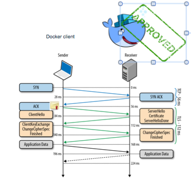
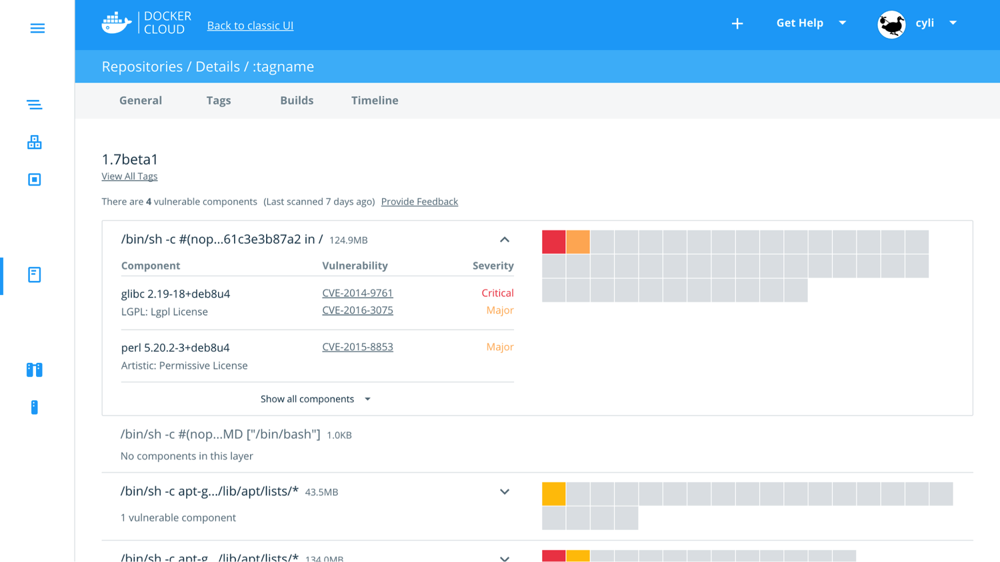
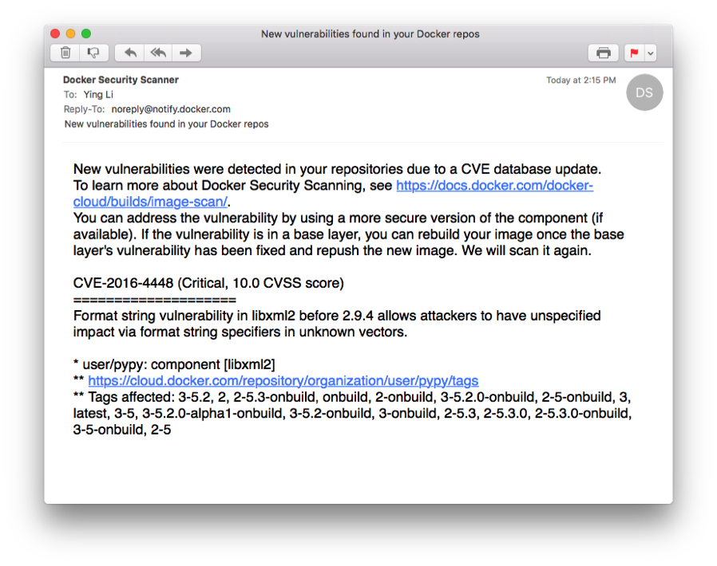
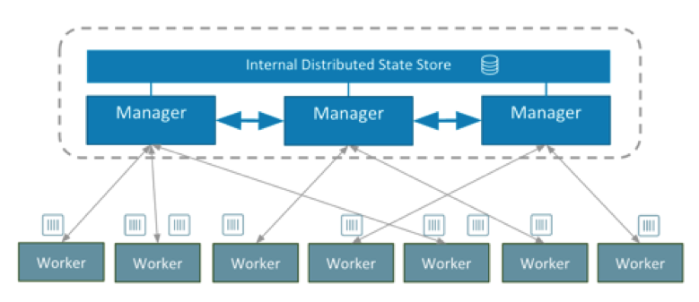
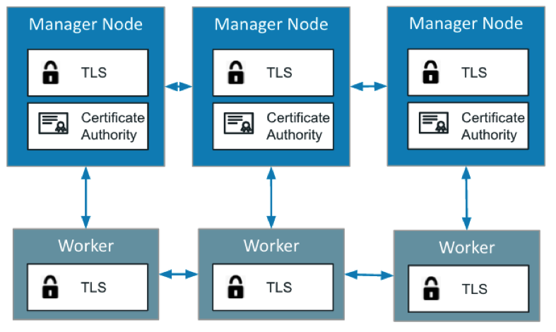
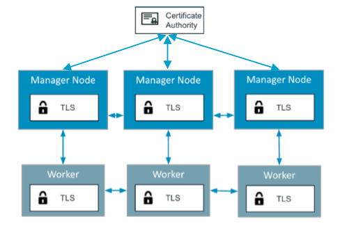
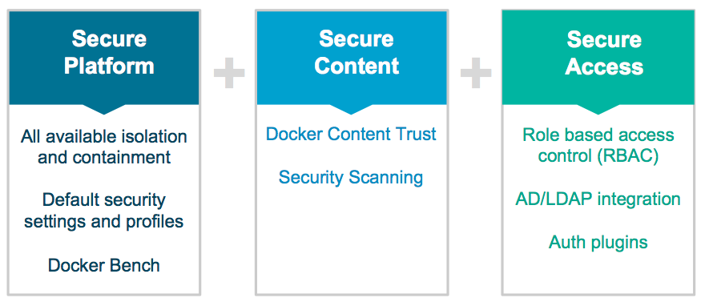

# Docker Security Workshop


Note:
This workshop is part of docker training add on module, security deep dive. This is one day workshop with lecture and labs.

---


## Course Objectives

- During this course, you will Learn

  - Why Docker Platform is Secure
  - The core technologies of Docker built-in default security
  - What issues to consider when implementing Docker Security
  - How to deploy with add-on docker security features and tools
  - What are the best practice to make docker contents secure
  - How to make secure user management and access
  - Learn Docker Security Best Practices

Note:
We will cover the followings;
- See how docker implements default security features
- what features and tools are available in Docker platform
- How do you use them?

---

## Agenda

- Overview of Docker Security
- Isolation: Kernel Namespaces and Control Groups
- User Management
- Secure Image
- Networks
- Image Distribution
- Capabilities
- Seccomp
- Linux Security Modules

---

# Overview of Docker Security

Note:
Latest blog: https://www.docker.com/docker-security

---

## Is Docker Container Secure?

Some questions...

- Is it safe to run applications in docker containers?
- Can one docker container break out and into another?
- What is inside my container?
- How do I know where this code came from?
- How do I keep our team safe from bad components?
- How do I stay on top of patches for compliance and governance?

Note: To answer these questions, we need to understand how docker is implemented.
Docker first started out as creating a runtime mechanism where containers could : application code can be contained in a container image and then run on a host. And that provided a useful ability to move things around, but : move things around and run them and get the code up and running and going. But the really interesting dynamics came when Docker became, in a sense, a package manager. And what I mean by a package manager was, there was ability to share containers, ability to build on top of containers, on top of other images, and to build workflows around sharing those containers.  When you apply the security lens to these containers and workflows, the following questions arise that must be addressed "Is Docker container secure to use?"

---

## Docker Security High-Level Overview


Note: There are 3 areas to focus,
- give secure platform
- manage and package container images to be distributed
- provide secure access control to the running containers.

There are different security concerns for both developers and deve-ops, during development stage as well as deployment stage.

---

## Docker is additive to the security of your application ...

- The intrinsic security of the linux  

|           |               |
|----------|:-------------:|
|`cgroups` | limit the access processes and containers have to system resources |
| `namespaces` |running within a container cannot see, processes running in another container, or in the host system|
|Each container also gets its own `network stack`| meaning that a container doesn’t get privileged access to the sockets or interfaces of another container|
|           |               |

Note:
Docker containers are, by default, quite secure; especially if you take care of running your processes inside the containers as non-privileged users (i.e., non-root).

When you start a container with docker run, behind the scenes Docker creates a set of namespaces and control groups for the container.

Look Man page for each features!

Control Groups, `cgroups` are a feature of the Linux kernel that allow you to limit the access processes and containers have to system resources such as CPU, RAM, IOPS and network.

`Namespaces` provide the first and most straightforward form of isolation: processes running within a container cannot see, and even less affect, processes running in another container, or in the host system.

Each container also gets its own `network stack`, meaning that a container does not get privileged access to the sockets or interfaces of another container.


More details in this page: https://docs.docker.com/engine/security/security/

---

## Docker and Security feature of Kernel can enhance the security of your application ...


|           |               |
|----------|:-------------:|
|`seccomp` | an application sandboxing mechanism in the Linux kernel|
|`capabilities` | fine-grained control over superuser permissions, allowing use of the root user to be avoided|
|`AppArmor` | confine programs to a limited set of resources, and bind access control attributes to programs|
|`SELinux`| access control security policies|
|           |               |

Note:

You can add an extra layer of safety by enabling AppArmor, SELinux, GRSEC, or your favorite hardening solution.

Docker containers are very similar to LXC containers(LXC is a userspace interface for the Linux kernel containment features.), and they have similar security features; kernel namespaces, appamor and SELinux profiles, seccomp, chroots (using pivot_root), capabilities, and Cgroup.

Look Man page for each features!

---

## Docker is Secure by default


Note: Docker enables Linux Kernel isolation capabilities wihh default security setting, and ddd-on Docker customizable profile settings will enhance  secure  default  docker platform further. Docker platform provide the additional customizable secure platform.

---


## Protect the Docker daemon socket with TLS certificates

- Docker runs via a non-networked Unix socket in default mode.
- Docker can communicate using an HTTP socket between docker client and docker engine

  - Enable TLS by specifying the `tlsverify` flag
  - `tlscacert` flag to a trusted CA certificate.

Note:
By default Docker (and by extension Docker Swarm) has no authentication or authorization on its API, relying instead on the filesystem security of its unix socket /var/run/docker.sock which by default is only accessible by the root user.

Docker supports using TLS certificates (both on the server and the client) to provide proof of identity. When set up correctly it will only allow clients/servers with a certificate signed by a specific CA to talk to eachother. While not providing fine grained access permissions it does at least allow us to listen on a TCP socket and restrict access with a bonus of also providing encryption.

---

## Exposing your docker engine to the internet

- Edit config at ``/lib/systemd/system/docker.service``

```
- ExecStart=/usr/bin/docker daemon -H fd://
+ ExecStart=/usr/bin/docker daemon -H fd:// -H tcp://0.0.0.0:2376
```

- Reload `systemd` and restart the Docker service:

```
$ sudo systemctl daemon-reload
$ sudo systemctl restart docker
```

Note: One way to expose docker on the internet is when docker service starts.


---

## Docker Client-Engine Communication set up One Way TLS

- Docker Client and Docker Engine can communicate via UNIX socket or TCP socket.
- Same way we trust websites:
  - Server Cert and Key on Engine
  - CA Cert on Client
  - Client authenticates Docker engine

cert    cert and key

Note:

How docker client communicate with docker engine?

Protect the Docker daemon socket, Secure communication is similar to secure website.

By default, Docker runs via a non-networked Unix socket. It can also optionally communicate using an HTTP socket.

In the daemon mode, it will only allow connections from clients authenticated by a certificate signed by that CA.

In the client mode, it will only connect to servers with a certificate signed by that CA.

You can use  OpenSSL, x509 and TLS to setup your own TLS.

More deails are here: https://docs.docker.com/engine/security/https/

---

## Run Docker Deamon and Docker Client with cert and Key, with `tlsverify`

- Make the Docker daemon only accept connections from clients providing a certificate trusted by our CA


```
$ dockerd --tlsverify --tlscacert=ca.pem --tlscert=server-cert.pem --tlskey=server-key.pem \
  -H=0.0.0.0:2376
```

- Connect to Docker and validate its certificate

```
$ docker --tlsverify --tlscacert=ca.pem --tlscert=cert.pem --tlskey=key.pem \
  -H=$HOST:2376 version
```

---

## Secure docker client by default

- Instead of passing ``-H=tcp://$HOST:2376`` and ``--tlsverify`` on every call

  1. Move the files to the ``.docker`` directory in your home directory
  2. Set the ``DOCKER_HOST`` and ``DOCKER_TLS_VERIFY`` variables

```
$ mkdir -pv ~/.docker
$ cp -v {ca,cert,key}.pem ~/.docker
$ export DOCKER_HOST=tcp://$HOST:2376 DOCKER_TLS_VERIFY=1
```

Note: The step by step details are here.
http://stackoverflow.com/questions/38286564/docker-tls-verify-docker-host-and-docker-cert-path-on-ubuntu

---

## Docker-machine: One Way TLS by default

**docker-machine** does this automatically to set up TLS for you
by default!

Note: This is a best practice example.  Docker Machine is a tool that lets you install Docker Engine on virtual hosts, and manage the hosts with docker-machine commands. You can use Machine to create Docker hosts on your local Mac or Windows box, on your company network, in your data center, or on cloud providers like AWS or Digital Ocean.

---

## Enhance Docker Client-Engine Communication with Mutual TLS

- Client also presents certificate   
  - Sends after verifying server cert
  - Mutual authentication             
- Client CA on daemon (engine)         

cert and key   cert and key

Note: Mutual TLS can be the recommended, specially when your set up is exposing engine to the internet.


---

##  Docker aims to be Secure by Default

Common Vulnerabilities and Exposures(CVE) list that docker mitigated,  such that processes run in Docker containers were never vulnerable to the bug—even before it was fixed.

Feature lists are growing...

https://docs.docker.com/engine/security/non-events/

[CVE-2013-1956](https://cve.mitre.org/cgi-bin/cvename.cgi?name=CVE-2013-1956), 1957, 1958, 1959, 1979, CVE-2014-4014, 5206, 5207, 7970, 7975, CVE-2015-2925, 8543, CVE-2016-3134, 3135, CVE-2014-0181, CVE-2015-3339, CVE-2014-4699, CVE-2014-9529, CVE-2015-3214, 4036, CVE-2016-0728, CVE-2016-2383

Note: This assumes containers are run without adding extra capabilities or not run as --privileged.


Bugs with security issue, note for upgrade or patch or downgrade.
CVE stands for:Common Vulnerabilities and Exposures
non-events: never vulnerable

Pointers for things that we are covering, seccomp, isolated name spaces, Docker protect you from nastiy security bugs

---

## Docker Security Scanning

- Deep visibility with binary level scanning

  - Docker Cloud and Docker Hub can scan images in private repositories to verify that they are free from known security vulnerabilities or exposures
  - Report the results of the scan for each image tag
  - Detailed bill of materials (BOM) of included components and vulnerability profile
  - Checks packages against CVE database AND the code inside to protect against tampering

Note:
https://docs.docker.com/docker-cloud/builds/image-scan/

 Docker Security Scanning, formerly known as Project Nautilus. Available today as an add-on service to Docker Cloud private repositories and for Official Repositories located on Docker Hub, Security Scanning provides a detailed security profile of your Docker images for proactive risk management and to streamline software compliance. Docker Security Scanning conducts binary level scanning of your images before they are deployed, provides a detailed bill of materials (BOM) that lists out all the layers and components, continuously monitors for new vulnerabilities, and provides notifications when new vulnerabilities are found.

---

##Image scanning and vulnerability detection

- Checks against CVE database for declared layers
- Also performs binary scan to pick up on statically linked binaries
- Official repos have been scanned since Nov 2015, are rescanned often


Note:
Architectural diagram.

Security scanning is a service made up of a scan trigger which implements the APIs, the scanner, database, plugins.  The CVE scanning is a third party that plugs into our service that checks against the public CVE database.  So what happens?

A user/publisher pushes their image to their repo in Docker Cloud
The scan trigger kicks off the workflow by pulling the image from the repo, sending to the scanner service
The scanner service breaks up the image into layers and components then sends that to our validation service which checks each package against the CVE database and scans the binaries to make sure the contents of the packages are what they say they are.
Once complete, the data is sent back to security scanning and stored in our database as a JSON.  Those results per image are then sent back to Docker Cloud to be displayed in UI to the user.
If a new vulnerability is reported to the CVE database, a notification is sent to the security scanning service.  From there we check against our database and issue a notification to the account admin about the vulnerability and which repos and tags are affected.

Plugin framework - today we have one validation service connected but security scanning was designed in a way to easily add different validation services as needed

---

## Docker Security Scanning results



Note:
Docker Cloud can help by automating this vetting process.   If the security scanning service is enabled for a repository, then all the images can be easily audited for vulnerabilities, and the licenses for the components in the images can be viewed.  

---

## Docker Security Scanning Notification via Email



Note:
Docker Cloud can help by automating this vetting process.   If the security scanning service is enabled for a repository, then all the images can be easily audited for vulnerabilities, and the licenses for the components in the images can be viewed.  

---

## Image Management Tool: Docker Trusted Registry (DTR)

- The enterprise-grade **image storage** solution from Docker
- Securely store and manage the Docker images **behind firewall**
- Installed on-premises, or on a virtual private cloud
- Use as continuous delivery processes(CI) to build, run, and ship your applications
- Built-in security and access control
  - integrates with `LDAP` and `Active Directory`
  - Supports `Role Based Access Control` (RBAC)

Note:


Docker Trusted Registry can be installed on-premises, or on a virtual private cloud. And with it, you can store your Docker images securely, behind your firewall.

Built-in security and access control

DTR uses the same authentication mechanism as Docker Universal Control Plane. It has a built-in authentication mechanism, and also integrates with LDAP and Active Directory. It also supports Role Based Access Control (RBAC).

This allows you to implement fine-grain access control policies, on who has access to your Docker images.


More details on DTR architecture: https://docs.docker.com/datacenter/dtr/2.0/architecture/

We have separate training covering DTR.

---

## Securing Docker Engine and Docker Registry Communications with TLS

- Docker registry (i.e., a server) and the Docker daemon (i.e., a client)

```
/etc/docker/certs.d/        <-- Certificate directory
└── localhost               <-- Hostname
   ├── client.cert          <-- Client certificate
   ├── client.key           <-- Client key
   └── localhost.crt        <-- Certificate authority that signed
                                the registry certificate
```

Note:
Documentation is here,

https://docs.docker.com/engine/security/certificates/

---

## DTR: Image Management


---

## DTR: Built-in Security and Access Control

- Who can access and what can a user can access


---

## Secure Cluster Management
- Docker 1.12 integrates **SWARM**.
- create and manage TLS certificates to secure your cluster
- communications between managers and workers is secured via Mutual TLS



Note: You want to carefully control which docker hosts can join your swarm cluster.


Managers are special workers, they can run containers but are also involved in making decisions.

The roles of managers and workers are identified by x509 certificates issued from a central CA, operated by the leader.

All communications between managers and workers is secured via Mutual TLS using these certificates and CA to identify other nodes in the swarm.

Certificates are rotated frequently to ensure all identities are still accurate.

---

## SWARM mode: Mutual TLS by default
- Leader acts as CA. Any Manager can be promoted to leader.
- Workers and managers identified by their certificate.
- Communications secured with Mutual TLS.



Note: When the Docker Engine runs in swarm mode, manager nodes implement the Raft Consensus Algorithm to manage the global cluster state.

Any agent can connect to any manager.  If too many agents are connected to one manager, it is redirected to connect to another manager.

However, leaders are the only ones that can write to raft and issue certificates, running reconciliation loops, so all requests from agents are proxied to the leader.  If the leader dies, the rest of the managers do leader election and can pick up the work.

---

## SWARM mode: Support for External CAs
- Support for your own CA
- Forwards CSR(certificate signing request)s to external CA.



---

## SWARM mode:  Automatic Certificate Rotation
- Customizable certificate rotation periods.
  - Minimum window of 30 minutes.

- Occurs automatically.

- Ensures potentially compromised or leaked certificates are rotated out of use.
Whitelist of currently valid certificates.

---

## Auditing Tool: Docker Bench
- Opensource Auditing Tool http://dockerbench.com
- A script that checks for dozens of common best-practices around deploying Docker containers in production.
- Command to Run your hosts against the Docker Bench

```
git clone https://github.com/docker/docker-bench-security.git
cd docker-bench-security
docker build -t docker-bench-security .
docker run -it --net host --pid host --cap-add audit_control \
    -v /var/lib:/var/lib \
    -v /var/run/docker.sock:/var/run/docker.sock \
    -v /usr/lib/systemd:/usr/lib/systemd \
    -v /etc:/etc --label docker_bench_security \
    docker/docker-bench-security
```  

Note:
- Use docker-compose

git clone https://github.com/docker/docker-bench-security.git
cd docker-bench-security
docker-compose run --rm docker-bench-security
- Use script

git clone https://github.com/docker/docker-bench-security.git
cd docker-bench-security
sh docker-bench-security.sh

Learn more on this blog:
https://blog.docker.com/2015/05/understanding-docker-security-and-best-practices/

---

## Docker Bench Output
Run your hosts against the Docker Bench


---

## Docker secures your software supply chain



---

## Summary: Why Docker is Secure?

- Secure platform based on kernel with strong default policies that you can further enhance.
- Docker enforce communications over TLS
- Docker Content Trust:
  - User Credentials, deployment hosts, access controls
  - Expiring signing mechanism for you
- Proactive vulnerability management through Docker Security  Image Scanning
- Secure Inventory management tools, UCP, and DTR
- Default secure clustering on SWARM mode
- Tools: Docker Bench for audit the security of your individual docker hosts


Note:

For More information:

https://blog.docker.com/2015/05/understanding-docker-security-and-best-practices/

---

## Best way to Understand Security Features

- Knowing which security features or tool to use
- Understand underlying Docker Security implementation details
- Learn best practices
- Learn **Do!** and **Do Not!**

Note:

Best Practices example
- Use MutualTLS for client server communications
- Run container as a non-root
- Mount read only volume
- etc

---
