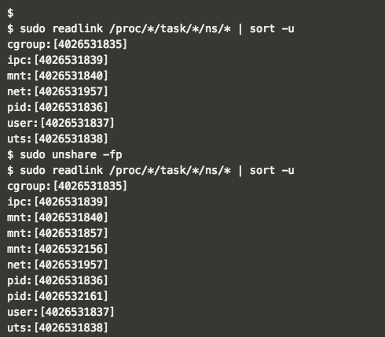
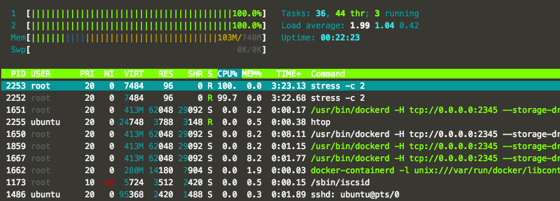

# Isolation: Kernel Namespaces and Control Groups

---

## Linux Kernel namespaces

- Provide processes with  their own view of the system
  - `namespaces` = limits what you can see and use
  - `cgroup` = limits how much you can user

---

|Namespace|constant |Isolates|
|-------|:---------------:|:-----|
|cgroup |CLONE_NEWCGROUP  |Cgroup root directory|
|IPC    |SCLONE_NEWIPC    |System V IPC, POSIX message queues|
|Network|		CLONE_NEWNET	|	Network devices, stacks, ports, etc.|
|Mount	|	CLONE_NEWNS	    |	Mount points|
|PID	  |		CLONE_NEWPID  |	Process IDs|
|User	  |		CLONE_NEWUSER	|	User and group IDs|
|UTS		|	CLONE_NEWUTS	  |	Hostname and NIS domain name|

Note:
Man page for namespaces

http://man7.org/linux/man-pages/man7/namespaces.7.html


---

## Kernel Namespaces for docker container: what containers can see

- The processes within the namespace, have their own isolated instance of the global resource.
- Namespaces are materialized by pseudo-files in ``/proc/<pid>/ns``

```
ls -la /proc/<pid>/ns/
```

```
> sudo ls -la /proc/1512/ns                                                                                                 
total 0                                                                                                                     
dr-x--x--x 2 root root 0 Nov  8 04:12 .                                                                                     
dr-xr-xr-x 9 root root 0 Nov  8 04:05 ..                                                                                    
lrwxrwxrwx 1 root root 0 Nov  8 04:12 ipc -> ipc:[4026531839]                                                               
lrwxrwxrwx 1 root root 0 Nov  8 04:12 mnt -> mnt:[4026531840]                                                               
lrwxrwxrwx 1 root root 0 Nov  8 04:12 net -> net:[4026531956]                                                               
lrwxrwxrwx 1 root root 0 Nov  8 04:12 pid -> pid:[4026531836]                                                               
lrwxrwxrwx 1 root root 0 Nov  8 04:12 user -> user:[4026531837]                                                             
lrwxrwxrwx 1 root root 0 Nov  8 04:12 uts -> uts:[4026531838]
```

- Each process is in one namespace of each type

Note: Behind, Docker creates a set of namespaces and control groups for the container.
tree of all the namespaced
isolated view of the host, network namespaces, user namspace
namespace is segment that container sees.

---

## Example using namespaces directly

- Using namespaces API ``unshare()`` to move the calling process to a new namespaces.

- Create a shell process with pid and fs namespaces.

```
$ sudo unshare -fp
$ sudo unshare -fp --mount-proc
```


Note:
Man page for namespaces
http://man7.org/linux/man-pages/man7/namespaces.7.html

---

## User Namespaces
- Docker deamon running as a `root`

```
$ ps aux | grep dockerd                                                                                          
root      1555  0.3  5.0 377460 38660 ?        Ssl  14:42   0:00 /usr/bin/dockerd -H tcp://0.0.0.0:2345 --storage-
driver=overlay -H unix:///var/run/docker.sock -H fd://                                                            
```

- Start Docker Container with non root user with ``--user`` flag

```
> sudo docker run --rm --user 1000:1000 alpine  id                                                                           
uid=1000 gid=1000
```

Note:
- Allows to map `UID/GUID`
  - UID 0-> 1999 in contianer C1 mapped to UID 10000-11999 on hosts
  - UID 0->1999 in container C2 is mapped to UID 12000->13999 on host
  - etc..

---

## cgroup: *Control Groups*

Container Resource Metering and limiting

- CPU
- Memory
- PIDs
- Block I/O
- network (with cooperation from iptables/tc)


Note:
man page for cgroup
http://man7.org/linux/man-pages/man7/cgroups.7.html

---

## CPU cgroup

- Keeps track of user/system CPU time
- Keeps track of usage of CPU
- Allows to set weights
- Can't set CPU time

---

## `cpuset` cgroup
- Pin groups to specific CPU(s)
- Reserve CPUs for specific apps
- Avoid Processes bouncing between CPUs
- Also relevant for NUMA systems
- Provide extra dials and knobs

---

## cgroups example with CPUs:


Running 4 continers on 4 different CPUs


---

## cgroups: CPU USAGES

- Limit CPU usage, cgroup can assign CPUs to containers.

- ``docker run``
  - ``--cpu-shares``	CPU shares (relative weight)
  - ``--cpuset-cpus``	CPUs in which to allow execution (0-3, 0,1)
  - ``--pids-limit``	Tune container pids limit (set -1 for unlimited)


Note: Example using limit CPU usage, cgroup can assign CPUs to containers one.
Other example would be for memory, and PID

---
## Docker Run with ``--cpuset-cpu``

`htop` output using ``--cpuset-cpu`` to 2



Note:
This node has 2 CPUs

---

## cgroups: *fork bump*


Recursively forking and ran out of resources,
docker pids limits the number that container can create.


----

## Full container capabilities ``–privileged``

Do not Start Docker Container this way!!!

- lifts all the limitations enforced by the device `cgroup` controller.  
- the container can then do almost everything that the host can do.
- This flag exists to allow special use-cases, like _running Docker within Docker_.

Note: example usage for device:
http://obrown.io/2016/02/15/privileged-containers.html

---

## Hands-On Exercise:
www.katacoda.com/docker-training/courses/security-course
- **cgroups** scenario


---
