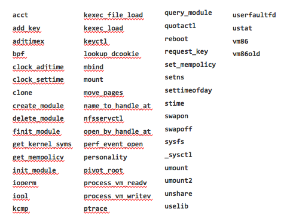

# Capabilities

---

##  To  be Root or Not to be Root

- `Capabilities` breakdown `root` permissions into groups that can be individually allowed or blocked
	- Often do not want or need all root permissions
	- Can reduce attack surface by reducing capabilities

Note: http://man7.org/linux/man-pages/man7/capabilities.7.html

---

## Docker Default Capabilities

In whitelist:
```		
"CAP_CHOWN",
"CAP_DAC_OVERRIDE",
"CAP_FSETID",
"CAP_FOWNER",
"CAP_MKNOD",
"CAP_NET_RAW",
"CAP_SETGID",
"CAP_SETUID",
"CAP_SETFCAP",
"CAP_SETPCAP",
"CAP_NET_BIND_SERVICE",
"CAP_SYS_CHROOT",
"CAP_KILL",
"CAP_AUDIT_WRITE",
```

Note: http://man7.org/linux/man-pages/man7/capabilities.7.html

CAP_CHOWN
Make arbitrary changes to file UIDs and GIDs (see chown(2)).

CAP_DAC_OVERRIDE
Bypass file read, write, and execute permission checks.  (DAC
is an abbreviation of "discretionary access control".)

CAP_FSETID
Don't clear set-user-ID and set-group-ID mode bits when a file is	does not match the filesystem or any of the supplementary GIDs of the calling process.

---

## Docker Default Capabilities (Continued)
Not In whitelist:
```		
"CAP_AUDIT_CONTROL",	"CAP_AUDIT_READ",
"CAP_BLOCK_SUSPEND",	"CAP_DAC_READ_SEARCH",		
"CAP_IPC_LOCK",	"CAP_ICP_OWNER",		
"CAP_LEASE",		"CAP_LINUX_IMMUTABLE",		
"CAP_MAC_ADMIN",	"CAP_MAC_OVERRIDE",		
"CAP_NET_ADMIN",	"CAP_NET_BROADCAST",		
"CAP_SYS_ADMIN",	"CAP_SYS_BOOT",		
"CAP_SYS_MODULE",	"CAP_SYS_NICE",		
"CAP_SYS_PACCT",	"CAP_SYS_PTRACE",		
"CAP_SYS_RAWIO",	"CAP_SYS_RESOURCE",		
"CAP_SYS_TIME",	"CAP_SYS_TTY_CONFIG",		
"CAP_SYSLOG",		“CAP_WAKE_ALARM",
```

Note:
CAP_AUDIT_CONTROL (since Linux 2.6.11)
              Enable and disable kernel auditing; change auditing filter
              rules; retrieve auditing status and filtering rules.

---

## How do we add/remove capabilities?

```
docker run --cap-add
docker run --cap-drop
docker run --cap-drop ALL --cap-add $CAP
```

Where ``$CAP`` starts with ``CAP_``

---

## Configure capabilities in compose

cap_add:
- CAP_NET_BROADCAST
- CAP_NET_RAW


cap_drop:
- ALL

---

## What to watch out for
- Read the fine print for each capability!
- man capabilities
	``$ man capabilities``

- i.e. removing CAP_KILL
 only requires permissions checks and enabling bypasses permissions checks. It doesn’t generically enable/disable the ability to kill
- CAP_SYS_ADMIN is nearly root...

---


## Capabilities and Docker
- No extended attributes in images -> no capabilities elevation normally possible

- Use docker to reduce capabilities
- Docker can not grant capabilities to non-root users due to some limitations in older kernel versions

---

## Capabilities and Docker
Your options from worst to best:
1. Manual management within the container:
```
docker run --cap-add ALL
```
2. Restricted capabilities (still root):
```
docker run --cap-drop ALL --cap-add ABC
```
3. No capabilities:
```
docker run --user
```

---

## Docker Capabilities Examples


- Start a new container and prove that the container's root account can change the ownership of files.

```
sudo docker run --rm -it alpine chown nobody /
```

- Start another new container and drop all capabilities for the containers root account other than the ``CAP_CHOWN`` capability.

```
sudo docker run --rm -it --cap-drop ALL --cap-add CHOWN alpine chown nobody /
```

- Listing all capabilities, start a new container using Alpine Linux, install the `libcap` package and then list capabilities.

```
sudo docker run --rm -it alpine sh -c 'apk add -U libcap; capsh --print'
```

Note:  Remember that Docker does not use the "CAP" prefix when addressing capability constants.


---

## What to watch out for
### CAUTION!!
```
$ docker run --privileged

```


- gives *all capabilities* to the container, also lifts limitations from  *device* cgroup


---

## Hands-On Exercise
www.katacoda.com/docker-training/courses/security-course
- **capabilities** scenario


---

# Seccomp

---

## Seccomp

- Linux system call operates on the Secure Computing (seccomp) state of the calling process
- An application sandboxing mechanism in the Linux kernel
- Original Seccomp
On-off feature that disabled all system calls except:
	- ``exit()``
	- ``read()``
	- ``write()``
	- ``sigreturn()``

Note: http://man7.org/linux/man-pages/man2/seccomp.2.html

---

## Seccomp-BPF
- Extension
- Allows us to configure what system calls are allowed/blocked
- Uses Berkeley Packet Filters (BPF)
- Allows examining system calls in detail before making a decision

Note:

More info on seecomp
http://man7.org/conf/lpc2015/limiting_kernel_attack_surface_with_seccomp-LPC_2015-Kerrisk.pdf

---

## Seccomp enabled?
In the kernel:
```
$ grep SECCOMP /boot/config-$(uname -r)
CONFIG_SECCOMP=y
CONFIG_SECCOMP_FILTER=y
```

In docker 1.12:
```
$ docker info
...
Security Options: apparmor seccomp
...
```

Note:
https://docs.docker.com/engine/security/seccomp/

In docker prior to 1.12:
```
$ docker run --rm alpine grep Seccomp /proc/self/status
```

---

## Docker Run with seccomp profile for a container

```
$ docker run --rm -it --security-opt seccomp=/path/to/seccomp/profile.json hello-world
```

with ``profile.json``

```
{
	"defaultAction": "SCMP_ACT_ERRNO",
	"architectures": [
		"SCMP_ARCH_X86_64",
		"SCMP_ARCH_X86",
		"SCMP_ARCH_X32"
	],
	"syscalls": [
		{
			"name": "accept",
			"action": "SCMP_ACT_ALLOW",
			"args": []
		},
		{
			"name": "accept4",
			"action": "SCMP_ACT_ALLOW",
			"args": []
		},
		...
	]
}
```

Note: https://docs.docker.com/engine/security/seccomp/

---

## Run without the default seccomp profile
```
$ docker run --rm -it --security-opt seccomp=unconfined debian:jessie \
    unshare --map-root-user --user sh -c whoami
		```


---

## Significant syscalls blocked by the default profile

Lots of system calls, what is excluded:



---

## What syscalls are used for a command with the strace tool

- show which syscalls are being used for `ls`

```
$ strace -c -f -S name ls 2>&1 1>/dev/null | tail -n +3 | head -n -2 | awk '{print $(NF)}'                        
access                                                                                                            
arch_prctl                                                                                                        
brk                                                                                                               
close                                                                                                             
execve                                                                                                            
fstat                                                                                                             
getdents                                                                                                          
getrlimit                                                                                                         
ioctl                                                                                                             
mmap                                                                                                              
mprotect                                                                                                          
munmap                                                                                                            
open                                                                                                              
read                                                                                                              
rt_sigaction                                                                                                      
rt_sigprocmask                                                                                                    
set_robust_list                                                                                                   
set_tid_address                                                                                                   
statfs                                                                                                            
write    

```

Note: strace can be used to get a list of all system calls made by a program. It's a very good starting point for writing seccomp policies. Here's an example of how we can list all system calls made by ls:


---

## Docker seccomp profile DSL(Domain Specific Language)

- Seccomp policy example:
	- Docker custom format for our JSON to specify `seccom`p

```
{
     "defaultAction": "SCMP_ACT_ERRNO",
     "architectures": [
         "SCMP_ARCH_X86_64",
    	    "SCMP_ARCH_X86",
    	    "SCMP_ARCH_X32"
	],
	   "syscalls": [
    	{
        	"name": "accept",
        	"action": "SCMP_ACT_ALLOW",
        	"args": []
    	},
    	...
	]
}
```

- Possible actions:
  - ``SCMP_ACT_KILL, SCMP_ACT_TRAP, SCMP_ACT_ERRNO, SCMP_ACT_ALLOW``

---

## Docker seccomp profile DSL(Domain Specific Language)
- More complex filters:
```
"args": [
  {
      "index": 0,
      "op": "SCMP_CMP_MASKED_EQ",
      "value": 2080505856,
      "valueTwo": 0
    }
]
```
- 2080505856 == 0x7C020000

---

## Seccomp and the no-new-privileges option
- Seccomp policies have to be applied before executing your container and be less specific unless you use:
```
--security-opt no-new-privileges
```
- In this case you need to allow only system call; `futex`(fast userspace mutex) `stat` `execve`.
- This flag also disables setuid binaries:
```
$ sudo ls
```
- sudo: effective uid is not 0, is /usr/bin/sudo on a file system with the 'nosuid' option set or an NFS file system without root privileges?

---

## Hands-On Exercise
www.katacoda.com/docker-training/courses/security-course
- **seccomp** scenario


```
$ docker run --rm -it --security-opt seccomp=default-no-chmod.json alpine chmod 777 /
```
chmod: /: Operation not permitted


---

# Linux Security Modules

---

## What is a LSM?
- A plugin to the linux kernel:
 	- Allows user to set policies to restrict what a process can do.
- **Mandatory Access Control**:
	- Instead of using user-defined permissions to specify access, the underlying system describes permissions itself with labels

---

## What is a LSM?
- Under the hood:
	- Each LSM implements a kernel interface that hooks into user-level syscalls about to access an important kernel object (inodes, task control blocks, etc.), either allowing them to pass through or denying them outright depending on the application profile


---

## Available LSMs
|LSMs|Docker Implemented|
|------|:---:|
|AppArmor|yes|
|SELinux|yes|
|Smack|no|
|Tomoyo|no|

---

## Deep Dive - AppArmor:
### File Access Management
- AppArmor uses globbing and deny syntax to express filepath restrictions

	- Deny read/write/lock/link/execute on files in ``/sys/``
```
  deny /sys/* rwklx
 ```
	- Deny on files in ``/sys/`` and subdirectories
```
deny /sys/** rwklx
```

---

## Deep Dive - AppArmor:
### Networking Management
|     Like firewall rules    |        |
|------|:---:|
|Can completely disable networking |           deny network|
|Can deny certain permissions |     deny network bind, inet|
|Can specify specific IP/ports |    network tcp src 192.168.1.1:80 dst 170.1.1.0:80|

---

## Deep Dive - AppArmor:
### Capability Management
- AppArmor can also deny capabilities with a simple syntax:
	- Deny capability `chown`
	- Deny capability `dac_override`

---

## Deep Dive - AppArmor:
### Composability
|C-style include statements   |        |
|------|:---:|
|include <abstractions/base>| built-in bundle of files |
|include "/etc/apparmor.d/include/foo" |absolute path from file|
|include "../relative_path/bar" |relative path from file|

---

## Deep Dive - AppArmor:
### Tools for debugging and generating profiles (on Ubuntu)

- Install ``apparmor-utils``
```
$ sudo apt install apparmor-utils
```
- Watch AppArmor block things!
```
$ aa-complain <PATH_TO_PROFILE>
```

- Interactive profile generation!
```
$ aa-genprof <PATH_TO_BINARY>
```


---

## Do I still need Seccomp and Cap-drop?
### Why not?  
- Docker sets a profile for each setting by default
	- Some overlap but each feature still adds unique functionality
	- Defense-in-depth

---

## Common mistake: disabling profiles
### CAUTION !!

- SELinux: `setenforce 0` (on daemon)
	- http://stopdisablingselinux.com/


- AppArmor: ``--security-opt apparmor:unconfined`` (on docker run)

- ``docker run --privileged``

---

## Hands-On Exercise
www.katacoda.com/docker-training/courses/security-course
- **apparmor** scenario


---


## View from 10,000 feet: Docker Security Checklist
- Build:
	- Use minimal images (alpine)
	- Use official images
	- Using images pulled by content trust (fresh, pulled by digest from authors you trust)
- Ship:
	- Push to your consumers with content trust
	- View results from Docker Security Scanning
- Run:
	- Read-only volumes and containers
	- User namespaces in the daemon
	- Limit resources with cgroups
	- Use the default apparmor/seccomp/capabilities, or your own tested profiles (not --privileged!)

---

## Advanced Topics
### Extra for Experts
---

## Running your own Notary
- Deploy a notary
```
$ git clone https://github.com/docker/notary.git
$ cd notary
$ docker-compose up
```
---

## Notary Delegations
```
(admin)$ notary key rotate <GUN> snapshot -r
(user)$ < generates private key and x509 cert, gives user.crt to admin >
(admin)$ notary delegation add <GUN> targets/user user.crt --all-paths
(admin)$ notary publish <GUN>
```

- Docker engine >= 1.11 will sign with delegation keys if it detects them

---
