# Module 2: Docker Security Workshop
<div style="background-image: url(images/image1.jpg)">

</div>

Note:
This will only display in the notes window.

---

## Goals of this workshop

<section>


    <aside class="notes">
        Oh hey, these are some notes. They'll be hidden in your presentation, but you can see them if you open the speaker notes window (hit 's' on your keyboard).
    </aside>
</section>

---

## Features
- See what features are available in Docker
- What do they do?
- How do you use them?

Note:
This will only display in the notes window.

----

## Understanding
- Look at some tools
- See underlying implementation details
- Learn best practices


---

## Do!


---

## Do not!


---

# Docker is additive to the security of your application ...

---
#Even if you do not use any of the techniques we cover

---
# Docker aims to be Secure by Default
https://docs.docker.com/engine/security/non-events/

CVE-2013-1956, 1957, 1958, 1959, 1979, CVE-2014-4014, 5206, 5207, 7970, 7975, CVE-2015-2925, 8543, CVE-2016-3134, 3135, CVE-2014-0181, CVE-2015-3339, CVE-2014-4699, CVE-2014-9529, CVE-2015-3214, 4036, CVE-2016-0728, CVE-2016-2383

---
# Why?

---
# How do we think about containers?

---
## How we talk about Docker

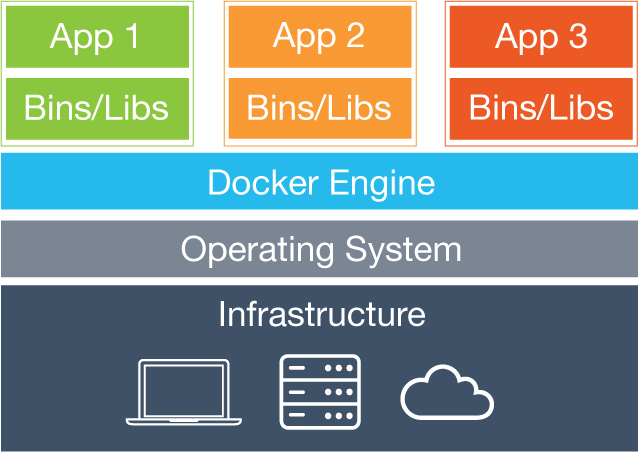

---
##How Docker Actually Works

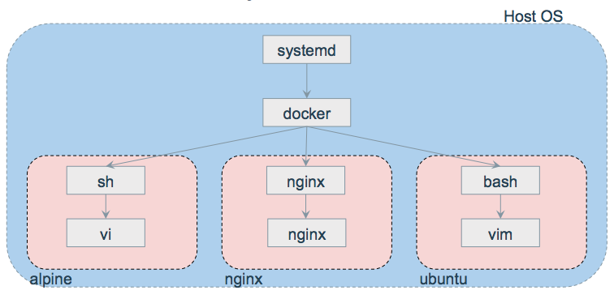

---
## Where can we see this?
top

---
# Anatomy of a Container

---
## Namespaces: what containers can see
```
ls -la /proc/<pid>/ns/
```

---
## What is namespaced?
|ID|Name|Usage|
|------|:---:|-----:|
|Cgroup|CLONE_NEWCGROUP|Cgroup root directory|
|IPC|SCLONE_NEWIPC|System V IPC, POSIX message queues|
|Network|		CLONE_NEWNET	|	Network devices, stacks, ports, etc.|
|Mount	|	CLONE_NEWNS	|	Mount points|
|PID	|		CLONE_NEWPID|		Process IDs|
|User	|		CLONE_NEWUSER	|	User and group IDs|
|UTS		|	CLONE_NEWUTS	|	Hostname and NIS domain name|


---
## Demo using namespaces directly
Create a shell process with pid and fs namespaces.
```
$ sudo unshare -fp
$ sudo unshare -fp --mount-proc
```

---
## cgroups: *what containers can use*
Aka *Control Groups* - limit container resources!
- CPU
- Memory
- PIDs

---
## cgroups: *what containers can use*
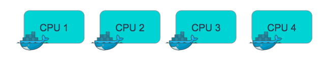

---
## cgroups: *what containers can use*
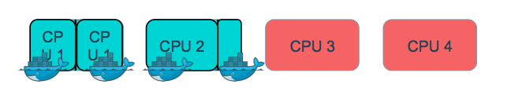

---
## cgroups: *what containers can use*
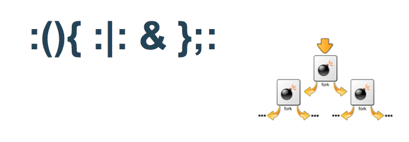

---
### Hands-On Exercise
Set up your AWS instance - check your email!

```
chmod 400 <PATH_TO_FILE>/<name>.pem
ssh -i <PATH_TO_FILE>/<name>.pem ubuntu@<Public DNS>
```
Example:
```
ssh -i riyaz.pem ubuntu@ec2-54-149...compute.amazonaws.com
```
```
git clone https://github.com/riyazdf/dockercon-workshop.git
- cgroups directory
```
NOTE: Ubuntu 15.10 does not support PID limits, but 16.04 does if you have it
So DO NOT run the fork bomb unless you have another machine.

---
# Securing Client-Engine Communications
*My first 5 minutes*

---
## Docker Client Server Architecture
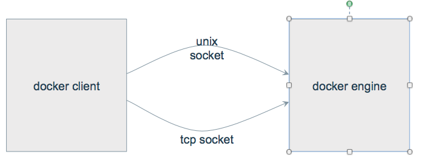

---
##Exposing your engine to the internet
Edit config at

/lib/systemd/system/docker.service

```
- ExecStart=/usr/bin/docker daemon -H fd://
+ ExecStart=/usr/bin/docker daemon -H fd:// -H tcp://0.0.0.0:2376
```
Restart Docker
```
$ sudo systemctl daemon-reload
$ sudo systemctl restart docker
```

---
##One Way TLS
Same way we trust websites:
- Server cert and key on engine
- CA cert on client
- client authenticates Docker engine
Docker client

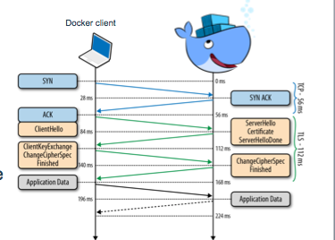

---
## Creating a CA
use a strong passphrase!
```
$ openssl genrsa -aes256 -out ca-key.pem 4096
$ openssl req -new -x509 -days 365 -key ca-key.pem -sha256 -out ca.pem
```

---
##Creating the daemon cert and key
```
$ openssl genrsa -out server-key.pem 4096
$ openssl req -subj "/CN=$HOSTNAME" -sha256 -new -key server-key.pem \
    -out server.csr
$ echo subjectAltName = IP:10.10.10.20,IP:127.0.0.1 > extfile.cnf
$ openssl x509 -req -days 365 -sha256 -in server.csr -CA ca.pem \
    -CAkey ca-key.pem -CAcreateserial -out server-cert.pem \
    -extfile extfile.cnf
$ sudo cp ca.pem /root/.docker/ca.pem
```

---
##Starting the daemon with the cert and key

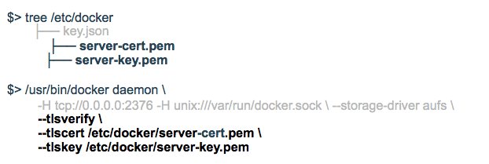

---
##Trusting the daemons cert on the client

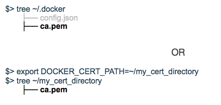


---
##Secure by default: docker-machine
docker-machine  does this automatically to set up TLS for you by default!


---
##Best practice: Mutual TLS
- Client also presents certificate
  - Sends after verifying server cert
  - Mutual authentication
- Client CA on daemon (engine)


---
##Creating client cert and key
```
$ openssl genrsa -out key.pem 4096
$ echo extendedKeyUsage = clientAuth > extfile.cnf
$ openssl x509 -req -days 365 -sha256 -in client.csr -CA ca.pem \
    -CAkey ca-key.pem -CAcreateserial -out cert.pem -extfile extfile.cnf
```

---
##Trusting the client cert on the daemon

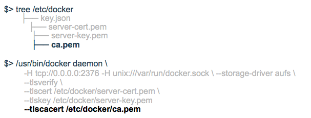

---
##Using the client certs on the client

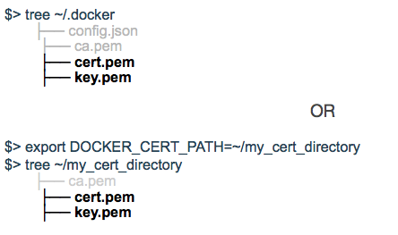

---
#Securing Engine-Registry Communications


---

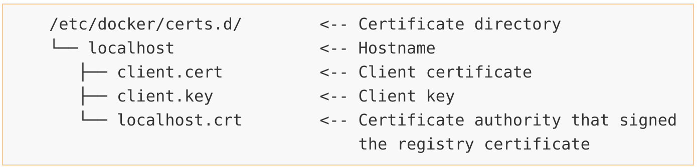

---
#What is in an image: The Layered Filesystem


---
##What is a layered filesystem?
Combine multiple directories to look like a single filesystem
- Tombstoning/whiteout files to delete files from lower layers

---
## Supported Implementations
- Aufs
- Btrfs
- OverlayFS
- Devicemapper


---
##Copy-on-write


---
##Best practice: *minimal* base images
alpine 					
- ~ 2 MB from hub (1 layer!)
- musl libc and busybox
ubuntu 				
- ~ 50 MB from hub

---
##Best practice: verify content
```
RUN apt-key adv \
      --keyserver hkp://keyserver.ubuntu.com:80 \
      --recv-keys BBEBDCB318AD50EC6865090613B00F1FD2C19886 \
    && echo deb http://repository.spotify.com stable non-free \
    | sudo tee /etc/apt/sources.list.d/spotify.list
```

---
##Best practice: read only containers
```
$ docker run it --rm --read-only alpine sh
```
Mounts the container’s FS as read-only


---
##Best practice: read-only Volumes
```
-v /data:/data:ro
```

---
##Common mistake: mount host location as writable
```
$ docker run it --rm -v /:/host alpine sh
```

---
##Best practice: minimal, read-only mounts
```
$ docker run it --rm -v /subdir/we/need:/dir:ro alpine sh
```

---
#Networks

---
##Isolate services
Control which services can talk to which other services
- Easier to audit

---
##Links (legacy)
Allow 2 specific containers to talk to each other.
- Brittle: does not survive container restarts
```
docker run -d --name db mysql:latest
docker run -d --link db wordpress
```

---
##Network Namespace
```
docker network create my_app
docker run -it --rm --net=my_app alpine sh
```
Links are dynamic, can be created to not yet created containers.  

---
##Best practice: Use Multiple Networks


---
##Common Mistake: --net=host
Container can see
**ALL**
 network traffic, including traffic on docker virtual networks

---
##Common Mistake: ports exposed on host
* Unnecessary
* Creates conflicts

---
##Best practice: Mutual TLS
Implementation detail
: use mutual TLS between pairs of services that need to talk to each other.

---
#User Management


---
##Default runs as root
```
$ docker run -v /bin:/host/bin -it --rm alpine sh
$ whoami
root
$ id
uid=0(root) gid=0(root)
$ # WREAK HAVOC TIME!  Please don’t do this
$ rm /host/bin/sh # Again, please don’t do this
```

---
##root in container == root outside container
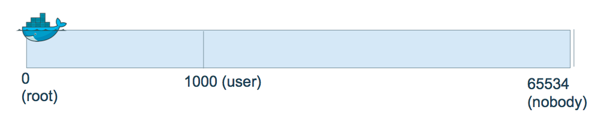
We do not want this to be the case!
How can we change this?

---
##Step in the right direction: run as a user
- Use the --user flag with UID:GID argument

```
$ docker run -v /bin:/host/bin --user 10000:10000 -it --rm alpine sh
$ whoami
whoami: unknown uid 10000
$ id
uid=10000 gid=10000
$ rm /host/bin/sh
rm: can’t remove ‘sh’: Permission denied
```

---
##But I still want *root* inside container


Perhaps we need to run a command that needs to look like it’s root in the container, but we don’t want to give it
true
 root access to the underlying host

---
##Enable user namespaces
```
$ docker daemon --userns-remap [uid[:gid]]
```
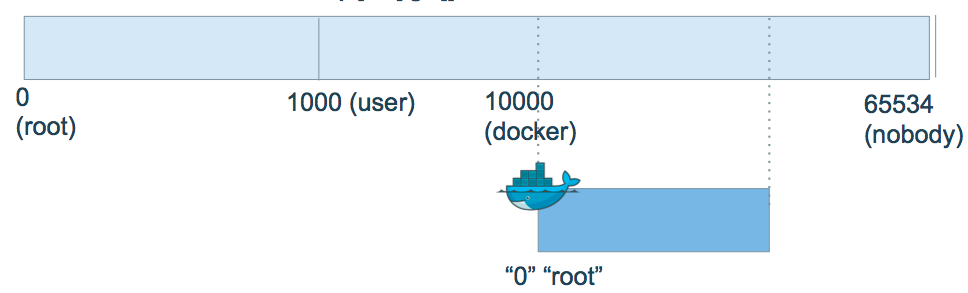


---
##Enable user namespaces - common pitfalls
```
$ docker daemon --userns-remap [uid[:gid]]
```
- Will need to re-pull images and re-create volumes due to container resource and image layer permissions
  - Leave this feature on in production; switching back and forth should only be done in development
  

---
##Hands-On Exercise && break
```
github.com/riyazdf/dockercon-workshop
```
 - **userns** directory


---
#Image Distribution


---
##Security Goals
Image Provenance and Trust
- Provenance: who made this image?
  - Verify the publisher of the image
- Trust: have the contents of this image been tampered with?
  - Verify the integrity of the image

---
##Pulling by tag
```
$ docker pull alpine:latest
```
Name resolution takes place in registry to find content-address of image
```
$ docker pull alpine
```
Using default tag: latest
Notice that the tag defaults to
latest
  if no tags are given!


---
##Pulling by digest
```
$ docker pull alpine@sha256:ea0d1389812...
```
No name resolution!

- *Security best practice*:
 pulling by digest to enforce consistent and “immutable” pulls because of content-addressability


---
##Content Trust
```
$ export DOCKER_CONTENT_TRUST=1
$ docker pull alpine:latest
```
Pull (1 of 1): alpine:latest@sha256:ea0d1389

- Benefits of pull by digest with ease of pull by tag


---


---


---
##Content Trust (on push)
```
$ export DOCKER_CONTENT_TRUST=1
$ docker tag alpine:latest <user>/alpine:trust
$ docker push <user>/alpine:trust
```
Looks the same as a regular push by tag!


---
##Content Trust (it’s more than gpg)
The push refers to a repository [<user>/alpine]
```
77f08abee8bf: Pushed
trust: digest: sha256:d5de850d728... size: 1355
Signing and pushing trust metadata
Enter passphrase for root key with ID e83f424:

Enter passphrase for new repository key with ID f903fc9 (docker.io/<user>/alpine):
Repeat passphrase for new repository key with ID f903fc9 (docker.io/<user>/alpine):
Finished initializing "docker.io/<user>/alpine"
Successfully signed "docker.io/<user>/alpine":trust
```

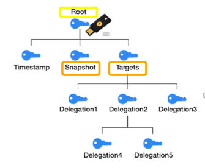


---
##Content Trust (it is more than gpg)
```
$ cat ~/.docker/trust/tuf/docker.io/alpine/metadata/timestamp.json | jq
```


---
##Docker Content Trust / Notary Threat Model
- Key compromise?
  - We can recover!
- Replay attacks?
  - Not with our freshness guarantees!
- Untrusted registry?
  - No problem!  DCT/Notary do not root any trust in the underlying content store or transport
  - Use signed TUF metadata to retrieve trusted hashes of content
  - Don’t even need to trust Notary server after first pull - local metadata pins trust, tagging keys are kept client-side for signing


---
##Docker Pull
Only pull trusted images
Use official images when possible!


---
#Docker Security Scanning (Nautilus)


---
##Docker Security Scanning (Nautilus)


https://hub.docker.com/r/library/alpine/tags/
- All official images on hub are scanned for vulnerabilities, lobby upstream for fixes!
- Can view scan results after logging into Docker Hub


---
##Docker Security Scanning (Nautilus)
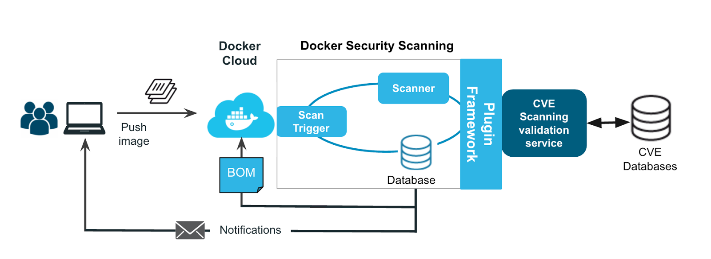

- Checks against CVE database for declared layers
- Also performs binary scan to pick up on
statically linked binaries
- Official repos have been scanned since Nov 2015, are rescanned often

---
#Hands-On Exercise
github.com/riyazdf/dockercon-workshop
- *trust* directory

---
#Capabilities

---
##Root vs Not Root
Capabilities breakdown root permissions into groups that can be individually allowed or blocked
- Often don’t want or need all root permissions
- Can reduce attack surface by reducing capabilities

---
##Docker Default Capabilities
In whitelist:
```		
"CAP_CHOWN",
		"CAP_DAC_OVERRIDE",
		"CAP_FSETID",
		"CAP_FOWNER",
		"CAP_MKNOD",
		"CAP_NET_RAW",
		"CAP_SETGID",
		"CAP_SETUID",
		"CAP_SETFCAP",
		"CAP_SETPCAP",
		"CAP_NET_BIND_SERVICE",
		"CAP_SYS_CHROOT",
		"CAP_KILL",
		"CAP_AUDIT_WRITE",
```

---
##Docker Default Capabilities (Continued)
Not In whitelist:
```		
"CAP_AUDIT_CONTROL",	"CAP_AUDIT_READ",
"CAP_BLOCK_SUSPEND",	"CAP_DAC_READ_SEARCH",		
"CAP_IPC_LOCK",	"CAP_ICP_OWNER",		
"CAP_LEASE",		"CAP_LINUX_IMMUTABLE",		
"CAP_MAC_ADMIN",	"CAP_MAC_OVERRIDE",		
"CAP_NET_ADMIN",	"CAP_NET_BROADCAST",		
"CAP_SYS_ADMIN",	"CAP_SYS_BOOT",		
"CAP_SYS_MODULE",	"CAP_SYS_NICE",		
"CAP_SYS_PACCT",	"CAP_SYS_PTRACE",		
"CAP_SYS_RAWIO",	"CAP_SYS_RESOURCE",		
"CAP_SYS_TIME",	"CAP_SYS_TTY_CONFIG",		
"CAP_SYSLOG",		“CAP_WAKE_ALARM",
```


---
##How do we add/remove capabilities?
```
docker run --cap-add
docker run --cap-drop
docker run --cap-drop ALL --cap-add $CAP
```

---
##Configure capabilities in compose
cap_add:

  - CAP_NET_BROADCAST
  - CAP_NET_RAW


cap_drop:

  - ALL


---
##What to watch out for
Read the fine print for each capability!
- man capabilities
- i.e. removing
CAP_KILL
 only requires permissions checks and enabling bypasses permissions checks. It doesn’t generically enable/disable the ability to kill
- CAP_SYS_ADMIN
is nearly root...

---
##What to watch out for
```
$ man capabilities
```

---
##Capabilities and Docker
- No extended attributes in images -> no capabilities elevation normally possible

- Use docker to reduce capabilities
- Docker can’t grant capabilities to non-root users due to some limitations in older kernel versions

---
##Capabilities and Docker
Your options from worst to best:
1. Manual management within the container:
```
docker run --cap-add ALL
```
2. Restricted capabilities (still root):
```
docker run --cap-drop ALL --cap-add ABC
```
3. No capabilities:
```
docker run --user
```


---
##What to watch out for
$ docker run --privileged …
- gives *all capabilities* to the container, also lifts limitations from  *device*
 cgroup

---
##Capabilities demo


---
##More information
github.com/riyazdf/dockercon-workshop
- capabilities directory

---
#Seccomp

---
##Original Seccomp
On-off feature that disabled all system calls except:
- exit()
- read()
- write()
- sigreturn()

---
##Seccomp-BPF
- Extension
- Allows us to configure what system calls are allowed/blocked
- Uses Berkeley Packet Filters (BPF)
- Allows examining system calls in detail before making a decision


---
##Is it enabled?
In the kernel:
```
$ grep SECCOMP /boot/config-$(uname -r) # or zgrep SECCOMP /proc/config.gz
CONFIG_SECCOMP=y
CONFIG_SECCOMP_FILTER=y
```
In docker:
```
$ docker run --rm alpine grep Seccomp /proc/self/status
```
In docker 1.12:
```
$ docker info
```

---
##Default Whitelist
Lots of system calls, what’s excluded:


---
##The strace tool
```
$ strace -c -f -S name ls 2>&1 1>/dev/null | tail -n +3 | head -n -2 | awk '{print $(NF)}'
```
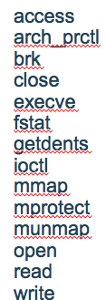


---
##Docker seccomp profile DSL
Seccomp
 policy example:
```
{
     "defaultAction": "SCMP_ACT_ERRNO",
     "architectures": [
         "SCMP_ARCH_X86_64",
    	    "SCMP_ARCH_X86",
    	    "SCMP_ARCH_X32"
	],
	   "syscalls": [
    	{
        	"name": "accept",
        	"action": "SCMP_ACT_ALLOW",
        	"args": []
    	},
    	...
	]
}
```

Possible actions:
- SCMP_ACT_KILL
- SCMP_ACT_TRAP
- SCMP_ACT_ERRNO
- SCMP_ACT_TRACE
- SCMP_ACT_ALLOW

---
##Docker seccomp profile DSL
More complex filters:
```
"args": [
  {
      "index": 0,
      "op": "SCMP_CMP_MASKED_EQ",
      "value": 2080505856,
      "valueTwo": 0
    }
]
```
2080505856 == 0x7C020000


---
##Seccomp and the no-new-privileges option
Seccomp policies have to be applied before executing your container and be less specific unless you use:
```
--security-opt no-new-privileges
```
In this case you need to allow only futex stat execve.
This flag also disables setuid binaries:
```
$ sudo ls
```
sudo: effective uid is not 0, is /usr/bin/sudo on a file system with the 'nosuid' option set or an NFS file system without root privileges?


---
##More information
github.com/riyazdf/dockercon-workshop
 - seccomp  directory
```
$ docker run --rm -it --security-opt seccomp=default-no-chmod.json alpine chmod 777 /
```
chmod: /: Operation not permitted

---
#Linux Security Modules


---
##What is a LSM?
A plugin to the linux kernel that allows us to set policies to restrict what a process can do.
- **Mandatory Access Control**: instead of using user-defined permissions to specify access, the underlying system describes permissions itself with labels


---
##What is a LSM?
Under the hood:
- each LSM implements a kernel interface that hooks into user-level syscalls about to access an important kernel object (inodes, task control blocks, etc.), either allowing them to pass through or denying them outright depending on the application profile
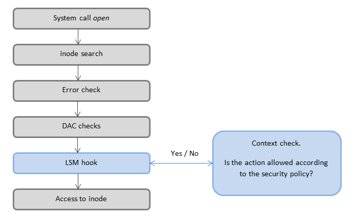

---
##Available LSMs
|LSMs|Docker Implemented|
|------|:---:|
|AppArmor|yes|
|SELinux|yes|
|Smack|no|
|Tomoyo|no|

---
##Deep Dive - AppArmor: File Access Management
AppArmor uses globbing and deny syntax to express filepath restrictions

- Deny read/write/lock/link/execute on files in /sys/  
```
  deny /sys/* rwklx
 ```
- Deny on files in /sys/ and subdirectories
```
deny /sys/** rwklx
```

---
##Deep Dive - AppArmor: Networking Management
|     Like firewall rules    |        |
|------|:---:|
|Can completely disable networking |           deny network|
|Can deny certain permissions |     deny network bind, inet|
|Can specify specific IP/ports |    network tcp src 192.168.1.1:80 dst 170.1.1.0:80|


---
##Deep Dive - AppArmor: Capability Management
AppArmor can also deny capabilities with a simple syntax:
- deny capability chown,
- deny capability dac_override

---
##Deep Dive - AppArmor: Composability
|C-style include statements   |        |
|------|:---:|
|include <abstractions/base>| built-in bundle of files |
|include "/etc/apparmor.d/include/foo" |absolute path from file|
|include "../relative_path/bar" |relative path from file|

---
##Deep Dive - AppArmor: Tools for debugging and generating profiles (on Ubuntu):

```
$ sudo apt install apparmor-utils
```
```
$ aa-complain <PATH_TO_PROFILE>
```
Watch AppArmor block things!

```
$ aa-genprof <PATH_TO_BINARY>
```
Interactive profile generation!


---
##Do I still need Seccomp and Cap-drop?
###Why not?  
Docker sets a profile for each setting by default
- Some overlap but each feature still adds unique functionality
- Defense-in-depth


---
##Common mistake: disabling profiles
- SELinux: setenforce 0 (on daemon)
http://stopdisablingselinux.com/
- AppArmor: --security-opt apparmor:unconfined (ondocker run)
This one’s a little harder to do “by accident”
- docker run --privileged


---
##Hands-On Exercise
github.com/riyazdf/dockercon-workshop
 - apparmor directory


---
##Docker Bench
https://dockerbench.com

- Open-source tool for running automated tests
  - inspired by the CIS Docker 1.11 benchmark
- Runs against containers currently running on same host
- Checks for AppArmor, read-only volumes, etc...


---
##View from 10,000 feet: Docker Security Checklist
####Build:
- Use minimal images (alpine)
- Use official images
- Using images pulled by content trust (fresh, pulled by digest from authors you trust)
####Ship:
- Push to your consumers with content trust
- View results from Docker Security Scanning
####Run:
- Read-only volumes and containers
- User namespaces in the daemon
- Limit resources with cgroups
- Use the default apparmor/seccomp/capabilities, or your own tested profiles (not --privileged!)

---
##Running your own Notary
Deploy a notary
```
$ git clone https://github.com/docker/notary.git
$ cd notary
$ docker-compose up
```
---
##Notary Delegations
```
(admin)$ notary key rotate <GUN> snapshot -r
(user)$ < generates private key and x509 cert, gives user.crt to admin >
(admin)$ notary delegation add <GUN> targets/user user.crt --all-paths
(admin)$ notary publish <GUN>
```

Docker engine >= 1.11 will sign with delegation keys if it detects them


---
##Thank you!
Please take the exercises home!  We’ll accept issues and pull requests :)
Learn more at
https://docs.docker.com/engine/security/security/

---
